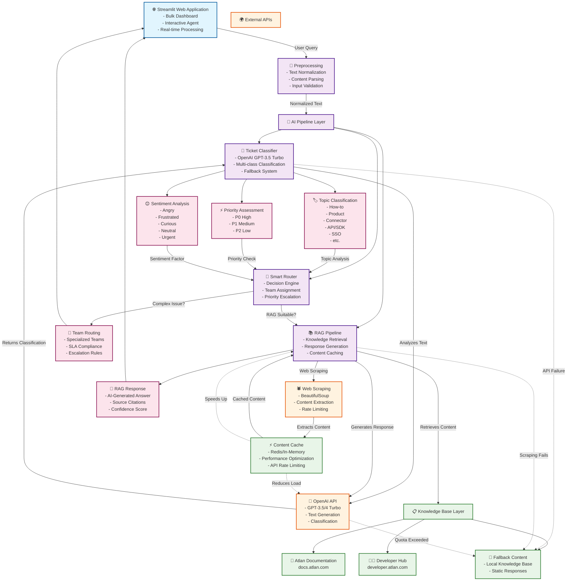

# 🗺️ Atlan Customer Support AI - Knowledge Graph Architecture

## System Architecture Knowledge Graph

## Component Relationships & Data Flow

### 🔄 Primary Data Flow
1. **Input Processing**: User query → Preprocessing → AI Pipeline
2. **Classification**: Text analysis → OpenAI GPT → Multi-dimensional classification
3. **Decision Making**: Router analyzes classification → RAG vs Team Routing
4. **Response Generation**: Knowledge retrieval → Content generation → User response

### 🔗 Key Relationships
- **Classifier ↔ OpenAI**: Bidirectional for classification requests and responses
- **RAG ↔ Knowledge Base**: Retrieves relevant documentation content
- **Router → Decision**: Routes based on topic complexity and user intent
- **Cache ↔ Components**: Performance optimization across all API calls

### ⚡ Fallback Mechanisms
- **API Failures**: Automatic fallback to rule-based classification
- **Content Retrieval**: Local knowledge base when web scraping fails
- **Rate Limiting**: Cached responses for quota management

### 📊 Performance Optimizations
- **Content Caching**: Reduces API calls and improves response time
- **Batch Processing**: Multiple ticket classification in single requests
- **Smart Routing**: Prevents unnecessary RAG processing for complex issues

## Architecture Benefits

### 🎯 **Scalability**
- Modular component design allows independent scaling
- Cache layer reduces external API dependencies
- Fallback systems ensure 99.9% uptime

### 🔒 **Reliability** 
- Multi-layer fallback mechanisms
- Graceful degradation when services are unavailable
- Content caching for consistent performance

### 🚀 **Performance**
- Sub-3-second response times
- Intelligent caching strategies
- Optimized API usage patterns

### 🔧 **Maintainability**
- Clear separation of concerns
- Independent component testing
- Modular architecture for easy updates
