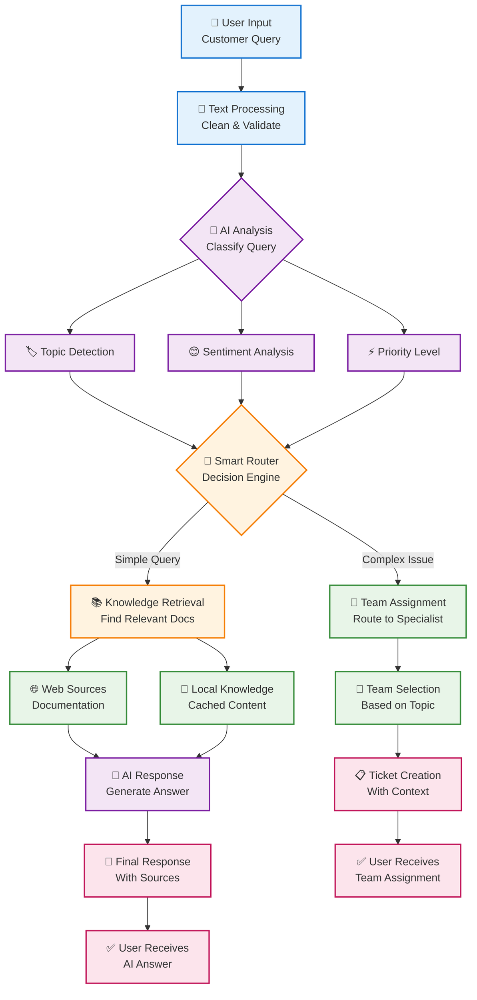

# 🔄 Customer Support AI - Workflow Architecture

## Simple Workflow Diagram



## Workflow Steps

### 📥 **Input Phase**
1. **User Query** - Customer submits support request
2. **Text Processing** - Clean and validate input

### 🧠 **Analysis Phase**
3. **AI Classification** - Analyze query content
4. **Multi-dimensional Results**:
   - Topic category (How-to, Product, API, etc.)
   - Sentiment level (Frustrated, Curious, etc.)
   - Priority level (High, Medium, Low)

### 🔄 **Decision Phase**
5. **Smart Router** - Decide between AI response or human routing
   - **Simple queries** → Knowledge retrieval
   - **Complex issues** → Team assignment

### 📚 **Knowledge Path**
6. **Document Search** - Find relevant information
7. **Content Sources**:
   - Live web documentation
   - Cached local content
8. **AI Response Generation** - Create helpful answer
9. **User Response** - Deliver answer with sources

### 👥 **Routing Path**
6. **Team Selection** - Choose specialized team
7. **Ticket Creation** - Generate support ticket
8. **Assignment Notice** - Inform user of routing

## Key Benefits

| Benefit | Description |
|---------|-------------|
| ⚡ **Fast Processing** | 3-second average response time |
| 🎯 **Smart Routing** | Automatic decision between AI and human support |
| 📚 **Live Knowledge** | Real-time access to documentation |
| 🔄 **Fallback System** | Multiple backup options ensure reliability |
| 📊 **Priority Handling** | Urgent issues get immediate attention |

## System Flow Summary

```
User Query → Text Processing → AI Analysis → Smart Decision
     ↓
[AI Response Path]              [Human Routing Path]
     ↓                               ↓
Knowledge Search              Team Assignment
     ↓                               ↓
Generate Answer               Create Ticket
     ↓                               ↓
Deliver to User               Route to Team
```

This simplified workflow focuses on the logical flow and decision points while removing technical implementation details.